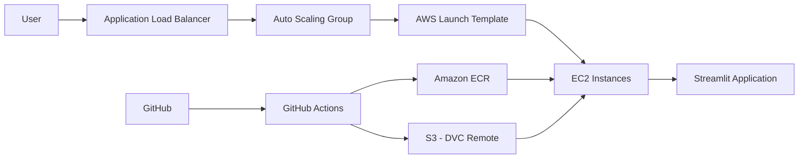

# 🏡 Real Estate Hybrid App

An **end-to-end Machine Learning & MLOps project** for **real estate price prediction and analytics**.

This project demonstrates how modern **data engineering**, **machine learning**, and **MLOps best practices** come together to build a **production-ready real estate system**.

---

## 🚀 Project Overview

The **Real Estate Hybrid App** is designed to solve real-world real estate problems by integrating multiple intelligent components into a single platform:

- 📈 **Price Prediction** – Predict property prices using machine learning models  
- 📊 **Interactive Analytics Dashboard** – Visual insights into real estate data  
- 🚀 **Production Deployment** – Dockerized with CI/CD automation  

The project follows:
- **Cookiecutter Data Science structure**
- **MLOps best practices**
- **Scalable and maintainable architecture**

---

## 🎯 Key Features

### ✅ Machine Learning
- Baseline models & advanced ensemble models  
- Hyperparameter tuning (Random Forest, LightGBM, Stacking)  
- Model evaluation & selection  
- Model registry & promotion workflow  

### ✅ Data Engineering
- Data collection via web scraping of publicly accessible real estate listings (Magicbricks, educational use only)  
- Robust data cleaning and preprocessing pipelines  
- Missing value handling and outlier treatment  
- Feature engineering for improved model performance  
- Dataset and model versioning using **DVC backed by Amazon S3**  


### ✅ Analytics & Visualization
- Exploratory Data Analysis (EDA)  
- Interactive Streamlit dashboards  
- Business-oriented insights  

### ✅ MLOps, CI/CD & Cloud Deployment
- CI/CD pipelines using GitHub Actions  
- Dockerized application  
- AWS cloud deployment  
- Model versioning & promotion  
- Automated testing  

---

## 🧪 Model Development Summary

- Designed and implemented an **end-to-end machine learning pipeline** for real estate price prediction using **40K+ Magicbricks property listings**
- Applied **advanced data preprocessing, EDA, and feature engineering** techniques
- Built and optimized a **LightGBM model** using **Optuna-based hyperparameter tuning**
- Final model achieved:
  - **R² ≈ 0.90**
  - **MAE ≈ ₹0.6 Cr**, demonstrating high predictive accuracy

---

## 🏗 Project Architecture


```
real-estate-hybrid-app/
│
├── .github/
│   └── workflows/
│       ├── ci-cd.yml                <- CI-CD pipeline (lint, test, build, Docker build & deploy) 
│                              
│
├── deploy/
│   └── scripts/
│       ├── install_dependencies.sh <- Install system & Python dependencies
│       ├── setup_backup.sh         <- Backup models & data
│       └── start_docker.sh         <- Run Docker containers
│
├── audits/
│   └── predictions.csv      <- Docker mount volume & security audit
│
├── data/
│   ├── external/       <- Third-party data
│   ├── interim/        <- Cleaned intermediate data
│   ├── processed/      <- Final ML-ready datasets
│   └── raw/            <- Original unmodified data
│
├── docs/
│   └── index.md
│
├── models/
│   ├── trained/
│   ├── predictions/
│   └── registry/
│
├── notebooks/
│   ├── scraping_realestate_data/
│   │   └── scrape_realestate.ipynb
│   │
│   ├── EDA.ipynb
│   ├── baseline_model.ipynb
│   ├── preliminary_data_cleaning.ipynb
│   ├── missing_values_imputation.ipynb
│   ├── locality_fix.ipynb
│   ├── model_selection.ipynb
│   ├── LightGBM_hp_tuning.ipynb
│   ├── random_forest_hp_tuning.ipynb
│   ├── dp_hp_tuning.ipynb
│   ├── stacking_regression_hp_tuning.ipynb
│   └── eda_helper_functions.py
│
├── my_app/                         <- Streamlit App
│   ├── home.py                     <- App entry point
│   └── pages/
│       ├── Analytics.py            <- Analytics dashboard
│       └── Price_Predictor.py      <- Price prediction UI
│
├── src/                            <- Core ML source code
│   ├── __init__.py
│   ├── config.py                    
│   ├── data_preparation.py         <- Data ingestion
│   ├── data_preprocessing.py       <- preprocessing & feature engineering
│   │
│   └── modeling/
│       ├── __init__.py            
│       ├── train.py                <- Model training
│       ├── evaluation.py           <- Model evaluation
│       └── model_registry.py       <- Model versioning
│
├── tests/
│   ├── test_model_perf.py
│   └── test_model_registry.py
│
├── .gitignore
├── Dockerfile
├── compose.yaml                   <- Docker Compose (with volume mounts)
├── Makefile
├── README.md
├── appspec.yml                    <- Deployment configuration
├── dvc.yaml
├── dvc.lock
├── params.yaml
├── promote_model.py               <- Promote model to production
│
├── pyproject.toml
├── requirements.txt
├── requirements-dev.txt
├── requirements-docker.txt
└── LICENSE
```
## 🔁 CI/CD Pipeline (GitHub Actions)

This project uses **GitHub Actions** to implement a complete **CI/CD pipeline**, automating testing, model promotion, Docker image creation, and AWS deployment.

The pipeline is triggered **on every push** to the repository.

---

## ⚙️ CI/CD Workflow Overview

### 🔹 Pipeline Trigger
- The workflow runs automatically on every `git push`
- Ensures continuous integration and continuous deployment

---

## 🧪 Continuous Integration (CI)

### 1️⃣ Code Checkout
- Pulls the latest source code from the GitHub repository

### 2️⃣ Python Environment Setup
- Uses **Python 3.12**
- Enables pip caching to speed up builds

### 3️⃣ Dependency Installation
- Upgrades pip
- Installs development dependencies from `requirements-dev.txt`

### 4️⃣ AWS Credentials Configuration
- Securely configures AWS credentials using GitHub Secrets
- Required for:
  - DVC S3 access
  - ECR
  - CodeDeploy

---

## 📦 Data & Model Versioning (DVC)

### 5️⃣ DVC Pull
- Pulls:
  - Versioned datasets
  - Trained models
- Data is fetched from **Amazon S3**, configured as the DVC remote
- Ensures reproducibility across environments

---

## 🧠 Model Validation & Testing

### 6️⃣ Model Registry Test
- Validates model registration logic
- Ensures correct model versioning and metadata
- Uses secure DAGsHub authentication token

### 7️⃣ Model Performance Test
- Checks model performance metrics
- Prevents performance regression
- Pipeline fails if model quality drops

---

## 🚀 Model Promotion

### 8️⃣ Promote Model
- Executes only if all previous steps succeed
- Promotes the best-performing model to production
- Updates the model registry automatically

---

## 🐳 Continuous Deployment (CD)

### 9️⃣ Amazon ECR Login
- Authenticates GitHub Actions runner with Amazon ECR
- Enables pushing Docker images securely

### 🔟 Docker Image Build & Push
- Builds Docker image from `Dockerfile`
- Tags image as `latest`
- Pushes image to **Amazon Elastic Container Registry (ECR)**

---

## 📦 Deployment Packaging

### 1️⃣1️⃣ Create Deployment Bundle
- Packages required deployment files:
  - `appspec.yml`
  - `compose.yaml`
  - Deployment scripts
- Creates `deployment.zip` for CodeDeploy

---

## ☁️ AWS Deployment

### 1️⃣2️⃣ Upload ZIP to Amazon S3
- Uploads deployment bundle to S3
- Acts as the source for CodeDeploy

### 1️⃣3️⃣ Deploy Using AWS CodeDeploy
- Triggers deployment using:
  - Application Load Balancer
  - Auto Scaling Group
- Performs rolling updates
- Ensures zero-downtime deployment

---

## 🏗 AWS Services Used in CI/CD

- **GitHub Actions** – CI/CD orchestration and automation  
- **Amazon S3** – DVC remote storage and deployment artifacts  
- **Amazon ECR** – Docker image registry  
- **Amazon EC2** – Application hosting  
- **AWS Launch Templates** – EC2 instance configuration and standardization  
- **Auto Scaling Group (ASG)** – Automatic scaling and high availability  
- **Application Load Balancer (ALB)** – Traffic distribution and health checks  
- **AWS CodeDeploy** – In-place application deployments with rolling updates  

---

- Fully automated ML lifecycle
- Reproducible experiments using DVC
- Model quality gates before deployment
- In-place deployments with controlled rollouts
- Scalable and production-ready architecture
- Minimal to zero downtime during releases

---

This CI/CD pipeline ensures that **only validated, high-quality models** are deployed to production automatically.

## 🏗 Cloud Architecture Overview




---

## 🧠 Why Launch Templates Are Important (Optional Explanation)

If you want a short explanation below the diagram, add this:

```markdown
### 🔹 AWS Launch Templates

- Define EC2 instance configuration:
  - AMI
  - Instance type
  - Security groups
  - IAM role
- Used by the Auto Scaling Group to launch consistent EC2 instances
- Ensures repeatable and reliable deployments
```


```markdown
## 🔐 Security & IAM Considerations

- AWS credentials managed via **IAM roles and GitHub Secrets**
- No hard-coded secrets in codebase
- S3 access restricted using least-privilege policies
- Docker images stored in private ECR repositories
```


## 🧑‍💻 Author

**Sourav Raj**  
Data Scientist | Data Analyst

Feel free to connect on LinkedIn or explore my other projects.

